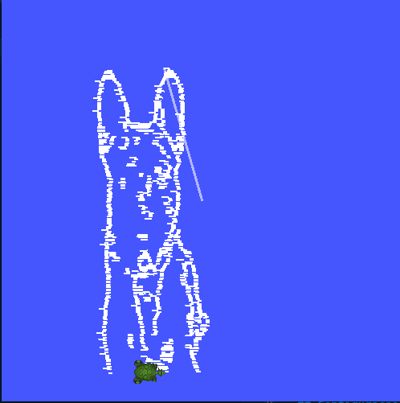

# Turtle Draw — Ponderada ROS 2

Pipeline completa de visão computacional implementada **do zero com NumPy** que extrai os contornos de uma imagem e faz a tartaruga do turtlesim reproduzi-los linha por linha na tela.



---

## Sumário

- [Estrutura do projeto](#estrutura-do-projeto)
- [Como funciona](#como-funciona)
- [Pipeline de Visão Computacional](#pipeline-de-visão-computacional)
- [Estratégia de desenho — scan-line](#estratégia-de-desenho--scan-line)
- [Arquitetura ROS 2](#arquitetura-ros-2)
- [Pré-requisitos](#pré-requisitos)
- [Build e execução](#build-e-execução)
- [Parâmetros](#parâmetros)
- [Justificativa das escolhas](#justificativa-das-escolhas)
- [Dependências](#dependências)

---

## Estrutura do projeto

```
pomnderada-ROS/
├── demo.png                           ← screenshot do resultado final
└── turtle_draw_ws/
    └── src/
        └── turtle_draw/
            ├── package.xml
            ├── setup.py
            ├── setup.cfg
            ├── resource/turtle_draw
            ├── images/
            │   └── dog.jpg            ← imagem de entrada (cachorro exemplo)
            └── turtle_draw/
                ├── __init__.py
                ├── cv_pipeline.py     ← Etapas 1 e 2: pré-processamento + detecção de bordas
                ├── path_planner.py    ← Etapa 3: planejamento de caminho (scan-line)
                └── turtle_controller.py  ← Etapa 4: nó ROS 2 principal
```

---

## Como funciona

```
Imagem (dog.jpg)
      │
      ▼  cv_pipeline.py
 ┌────────────┐
 │  Resize    │  Reduz para ≤ max_dim px (nearest-neighbour)
 │  Grayscale │  BT.601 — luminância perceptual
 │  Gauss Blur│  Kernel separável 5×5, σ=1.5 — remove ruído de textura
 │  Sobel     │  Kernels Kx/Ky 3×3 → magnitude √(Gx²+Gy²)
 │  Hysteresis│  Dois limiares → mapa binário de bordas
 └────────────┘
      │  edge_map (uint8, 255 = borda)
      ▼  path_planner.py
 ┌────────────┐
 │ Scan-line  │  Linha por linha: agrupa pixels de borda em runs horizontais
 │  planner   │  Cada run → waypoint pen-UP (teleporte) + waypoint pen-DOWN (desenho)
 └────────────┘
      │  waypoints[], pen_flags[]
      ▼  turtle_controller.py (ROS 2)
 ┌────────────┐
 │  pen UP    │  TeleportAbsolute — salto instantâneo, sem traço
 │  pen DOWN  │  Controlador proporcional — desenha o traço horizontal
 └────────────┘
      │
      ▼
  turtlesim — contorno desenhado na tela
```

---

## Pipeline de Visão Computacional

| # | Etapa | Método | Implementação |
|---|-------|--------|---------------|
| 1 | **Resize** | Nearest-neighbour | `np.linspace` + indexação fancy NumPy |
| 2 | **Grayscale** | Luminância BT.601: `Y = 0.114·B + 0.587·G + 0.299·R` | Operações matriciais NumPy |
| 3 | **Gaussian Blur** | Convolução 2D com kernel Gaussiano separável | Stride tricks (`np.lib.stride_tricks`) + `np.einsum` |
| 4 | **Sobel** | Kernels Kx/Ky 3×3 → `magnitude = √(Gx²+Gy²)` | Mesma infraestrutura de convolução |
| 5 | **Histerese dupla** | Strong/weak edges + dilatação por convolução 3×3 | NumPy puro |

> **OpenCV** é usado **única e exclusivamente** em `cv2.imread` para carregar a imagem.
> Todo o restante da visão computacional é implementado com NumPy.

### Visualização das etapas

Para inspecionar cada estágio da pipeline, use o parâmetro `visualize:=true`.
O resultado é salvo em `/tmp/cv_pipeline.png`:

```
┌────────────┬────────────┬────────────────┬──────────────────────┐
│ Grayscale  │ Gauss Blur │ Sobel magnitude│ Edge map (histerese) │
└────────────┴────────────┴────────────────┴──────────────────────┘
```

---

## Estratégia de desenho — scan-line

O mapa de bordas é percorrido **linha por linha, da esquerda para a direita** —
exatamente como uma impressora jato de tinta rasteriza uma página.

### Algoritmo

Para cada linha da imagem (de cima para baixo):
1. Encontra as colunas com pixels de borda: `np.where(edge_map[row] > 0)`.
2. Agrupa colunas consecutivas em **runs** (sequências contíguas de borda).
3. Para cada *run*:
   - **Waypoint pen-UP**: posição do início do run → tartaruga teletransporta (sem traço).
   - **Waypoint pen-DOWN**: posição do fim do run → tartaruga avança desenhando.

```
Linha 0:  ___XXX___XX______XX___
              ↑↑↑   ↑↑    ↑↑↑
          run 1      run 2  run 3
         [teleport→draw] × 3 runs

Linha 1:  ____XXXX_________XXX__
          [teleport→draw] × 2 runs
...
```

### Por que scan-line?

- **Sem traços fantasmas**: o teleporte entre runs e entre linhas não deixa marcas.
- **Ordem determinística**: o desenho progride visivelmente de cima para baixo.
- **Eficiente**: apenas os pixels de borda geram movimento de desenho; os espaços vazios são pulados instantaneamente.

---

## Arquitetura ROS 2

### Nó: `turtle_controller`

| Elemento | Tipo | Nome | Função |
|----------|------|------|--------|
| Publisher | `geometry_msgs/Twist` | `/turtle1/cmd_vel` | Envia velocidade linear/angular |
| Subscriber | `turtlesim/Pose` | `/turtle1/pose` | Lê posição e ângulo atual |
| Service client | `turtlesim/SetPen` | `/turtle1/set_pen` | Liga/desliga a caneta |
| Service client | `turtlesim/TeleportAbsolute` | `/turtle1/teleport_absolute` | Teleporte instantâneo |

### Controlador proporcional (fase de desenho)

O controlador opera a **20 Hz** e executa duas fases por waypoint de desenho:

```
θ_desejado  = atan2(dy, dx)
erro_θ      = θ_desejado − θ_atual    (normalizado para [−π, π])

Fase 1 — Rotação no lugar (|erro_θ| > 0.15 rad ≈ 9°):
  v = 0
  ω = Kp_ang · erro_θ   (limitado a ±max_omega)

Fase 2 — Avanço com correção angular:
  v = max(min_speed, Kp_lin · dist)   (limitado a draw_speed)
  ω = Kp_ang · erro_θ
```

### Lógica pen-UP vs pen-DOWN

```
pen_flags[i] = False  →  SetPen(off) + TeleportAbsolute(x, y, θ=0)
                          θ=0 → tartaruga já aponta para a direita,
                          eliminando a fase de rotação no próximo traço

pen_flags[i] = True   →  SetPen(on)  + controlador proporcional
```

---

## Pré-requisitos

```bash
# ROS 2 Humble + turtlesim
sudo apt install ros-humble-turtlesim

# Python
pip install numpy opencv-python matplotlib
```

---

## Build e execução

### 1. Build

```bash
cd turtle_draw_ws
source /opt/ros/humble/setup.bash
colcon build --symlink-install
source install/setup.bash
```

### 2. Terminal 1 — turtlesim

```bash
source /opt/ros/humble/setup.bash
ros2 run turtlesim turtlesim_node
```

### 3. Terminal 2 — controlador

```bash
cd turtle_draw_ws
source /opt/ros/humble/setup.bash
source install/setup.bash
ros2 run turtle_draw turtle_controller
```

### Limpar a tela entre execuções

```bash
ros2 service call /turtle1/clear std_srvs/srv/Empty
```

---

## Parâmetros

```bash
ros2 run turtle_draw turtle_controller \
  --ros-args \
  -p image_path:=/caminho/absoluto/para/imagem.jpg \
  -p row_step:=2 \
  -p draw_speed:=5.0 \
  -p sigma:=1.5 \
  -p low_ratio:=0.12 \
  -p high_ratio:=0.30 \
  -p max_dim:=400 \
  -p visualize:=true
```

| Parâmetro | Padrão | Descrição |
|-----------|--------|-----------|
| `image_path` | `share/.../dog.jpg` | Caminho absoluto para a imagem de entrada |
| `row_step` | `1` | Processa 1 a cada N linhas (1 = todas, 2 = linhas alternadas) |
| `draw_speed` | `3.0` | Velocidade máxima ao desenhar (m/s) |
| `sigma` | `1.5` | Desvio-padrão do filtro Gaussiano |
| `ksize` | `5` | Tamanho do kernel Gaussiano (deve ser ímpar) |
| `low_ratio` | `0.15` | Limiar fraco da histerese (fração do gradiente máximo) |
| `high_ratio` | `0.35` | Limiar forte da histerese |
| `max_dim` | `400` | Lado máximo da imagem redimensionada (px) |
| `visualize` | `false` | Salva figura das 4 etapas em `/tmp/cv_pipeline.png` |

---

## Justificativa das escolhas

### 1. Redimensionamento (nearest-neighbour)

Reduz a imagem para no máximo `max_dim` pixels no lado maior antes de qualquer
processamento. Dois motivos: (a) a convolução Gaussiana/Sobel tem custo
O(H·W·k²) — reduzir de 3000 px para 400 px é ~56× mais rápido; (b) menos
pixels de borda → menos waypoints → desenho mais ágil no turtlesim.

Nearest-neighbour é suficiente porque queremos estrutura global, não precisão
sub-pixel.

### 2. Grayscale (BT.601)

O Sobel opera sobre imagem monocanal. Usamos os coeficientes ITU-R BT.601
`Y = 0.114·B + 0.587·G + 0.299·R` em vez de média simples porque eles modelam
a sensibilidade perceptual humana: o olho é muito mais sensível ao verde (~59%)
do que ao azul (~11%). A média simples sub-representa o verde e
super-representa o azul, perdendo contraste em transições de tom.

### 3. Gaussian Blur (σ = 1.5, kernel 5×5)

A imagem do cachorro tem textura de pelos que cria falsos positivos densos no
Sobel. O filtro Gaussiano suprime esses gradientes de alta frequência sem
borrar os contornos reais (que têm gradiente mais largo).

Parâmetros escolhidos: σ = 1.5 captura a escala do ruído de textura; kernel
5×5 contém ≥ 99% da energia da Gaussiana com σ = 1.5 (`5 > 2·⌈2σ⌉`). Kernels
maiores trariam mais desfoque e apagamento de detalhes finos.

O kernel 2D é construído como produto externo de dois vetores 1D (propriedade
de separabilidade da Gaussiana), e a convolução usa stride tricks do NumPy para
evitar loops Python.

### 4. Sobel (3×3)

Os kernels Sobel aproximam as derivadas parciais ∂I/∂x e ∂I/∂y:

```
Kx = [[-1, 0, 1],      Ky = [[-1,-2,-1],
      [-2, 0, 2],             [ 0, 0, 0],
      [-1, 0, 1]]             [ 1, 2, 1]]
```

Os pesos ±2 na linha/coluna central suavizam na direção perpendicular,
dando ao Sobel melhor relação sinal-ruído do que uma diferença finita simples
`[-1, 0, 1]`. A magnitude resultante `√(Gx²+Gy²)` é independente da
orientação da borda.

### 5. Histerese dupla

Dois limiares (`low_ratio`, `high_ratio`) classificam os pixels do mapa de
magnitude em três categorias:

- **Strong** (≥ high_ratio): borda certa, sempre mantida.
- **Weak** (entre low e high): mantida apenas se tiver ao menos um vizinho
  strong na vizinhança 8-conectada.
- **Descartado** (< low_ratio): ruído.

Esse mecanismo produz contornos contínuos e conectados, ao contrário de um
limiar único que ou perde bordas fracas ou mantém ruído isolado. A dilatação
da máscara strong é implementada com a mesma convolução 3×3 de uns,
reutilizando toda a infraestrutura da pipeline.

### 6. Varredura linha por linha (scan-line)

A alternativa mais óbvia — ordenação greedy nearest-neighbour — minimiza
distância percorrida mas conecta pontos de bordas diferentes com segmentos que
cruzam a imagem, exigindo pen-up/pen-down frequente e produzindo traços de
conexão visíveis.

A varredura scan-line resolve isso: cada traço horizontal corresponde
exatamente a um run de pixels de borda reais. Não há conexão entre
estruturas diferentes. O padrão de execução também é visualmente intuitivo
(a imagem "emerge" de cima para baixo).

### 7. Controle ROS 2 — proporcional com teleporte

O controlador usa dois modos distintos:

- **Pen-UP (teleporte)**: `TeleportAbsolute` com `theta=0`. O salto é
  instantâneo (sem custo de tempo), a tartaruga já aponta para a direita ao
  chegar, eliminando a fase de rotação do próximo traço horizontal.

- **Pen-DOWN (controlador proporcional)**: fase de rotação no lugar quando
  `|erro_θ| > 0.15 rad` evita que a tartaruga corte curvas e deixe traços
  fora do lugar; fase de avanço usa velocidade mínima `min_draw_speed` para
  garantir que segmentos curtos (1-2 pixels) sejam completados sem que o
  controlador trave em velocidade próxima de zero.

---

## Dependências

```
ros-humble-turtlesim
python3-numpy
python3-opencv
python3-matplotlib
```
